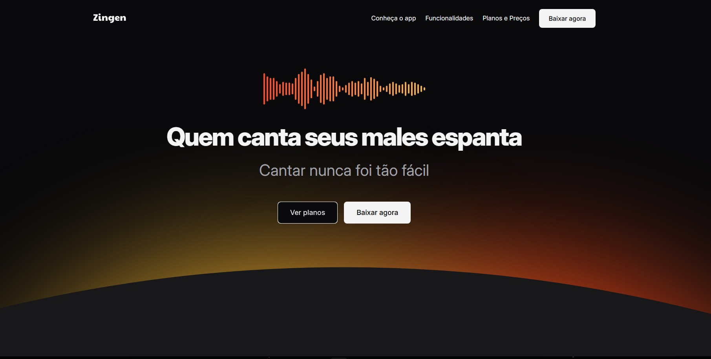

# Zingen 🎵

Projeto desenvolvido durante o curso Full Stack da Rocketseat, com foco em **responsividade**, utilizando apenas HTML e CSS.

## 🎯 Sobre o Projeto

O **Zingen** é uma landing page fictícia de um serviço de música, criada para praticar:

- Estruturação semântica com HTML  
- Estilização com CSS puro  
- Layouts responsivos  
- Uso de Flexbox e Media Queries  
- Adaptação do layout para diferentes tamanhos de tela  

O objetivo principal foi entender como construir interfaces que se ajustam corretamente em dispositivos desktop e mobile.

## 🛠️ Tecnologias Utilizadas

- HTML5  
- CSS3 (Flexbox e Responsividade)  

## 🎨 Layout

O layout foi fornecido pelo curso e adaptado para múltiplas resoluções de tela.

## 🚀 Acesse o Projeto

Repositório no GitHub:  
https://github.com/Jmrcs98/projeto-zingen

### Você pode acessar o design original no Figma:  
https://www.figma.com/community/file/1371886246180677672
